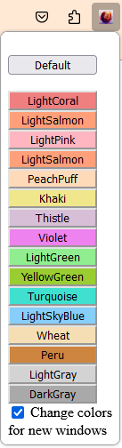
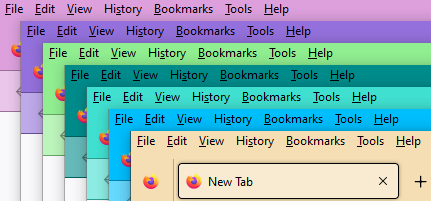

# Fox Color Box

This is a Firefox extension that allows you to change and customize browser Window colors.
When you open a new window, it will have a distinct color.  You can also change colors by
clicking on the extension icon:

Firefox extension download: https://addons.mozilla.org/en-US/firefox/addon/foxcolorbox/

### Demo

|                |                |
|----------------|----------------|
|  |  |

## Acknowledgements
* This extension was inspired by the [Colorful Windows](https://github.com/DaveDuck321/Colorful-window-theme) extension.

## Disclosure Notification

This program was completely developed on my own personal time, for my own personal benefit, and on my personally owned equipment.
